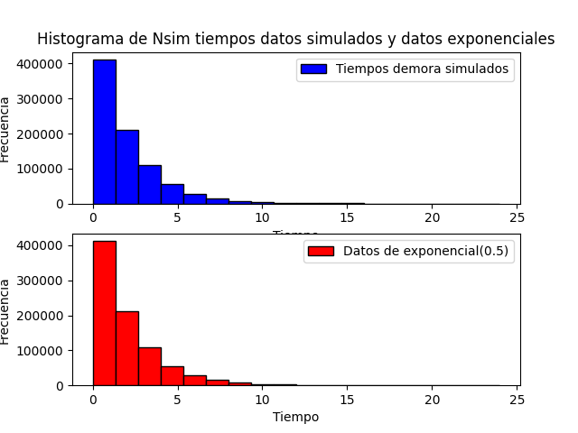
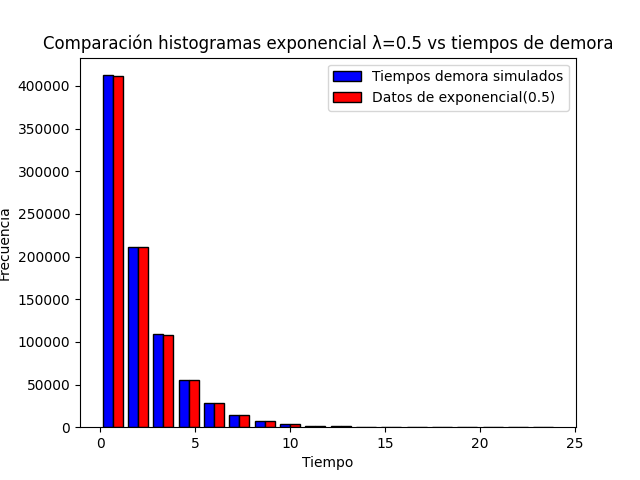
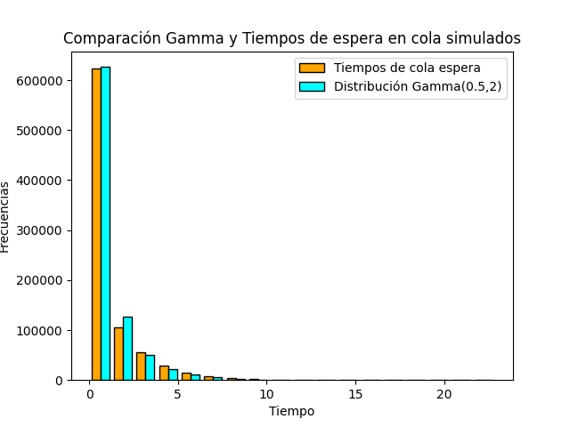
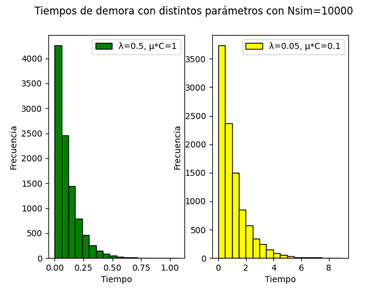
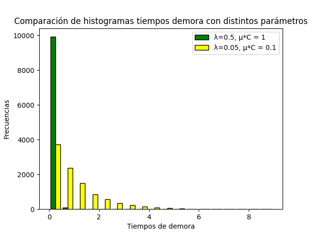
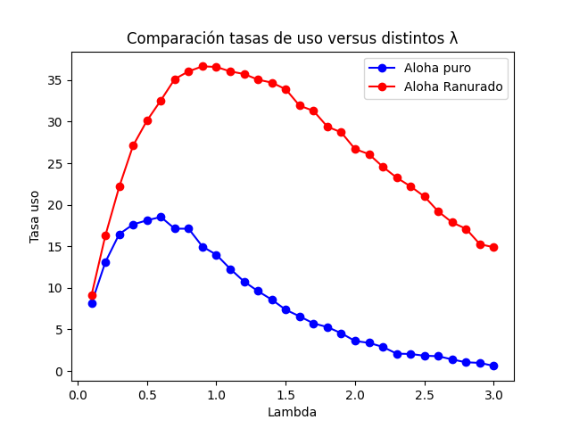

# Introducción

## Ejercicio 1

En este ejercicio debemos simular un canal en el que los paquetes llegan a él con una distribución de Poisson. El largo de los paquetes corresponde a una exponencial de media 1/mu, o también de parámetro mu, en donde mu = 1. También asumimos que el canal puede transmitir C = 1 bits por segundo. De esta formal, la tasa de servicio del canal será de mu * C  = 1 paquetes por segundo.

El algoritmo principal que simula el canal generará paquetes utilizando un Proceso de Poisson Homogéneo y luego atenderá los paquetes colocando los resultados en los arreglos correspondientes.

<!-- ====================================================================================================== -->

### Inciso 1
Para poder estudiar la variable `tau_m` correspondiente al `tiempo medio de demora` el algoritmo irá agregando en un arreglo el tiempo que demora cada paquete desde que llega al canal hasta que efectivamente se envía. Estos, luego serán los datos simulados que utilizaremos en los ejercicios 1, 2, 3 y 4.

Para obtener el intervalo de confianza de la estimación de la variable `tau_m` utilizaremos el algoritmo visto en el teórico con pequeñas modificaciones.

<!-- ====================================================================================================== -->

### Inciso 2
En este inciso debemos generar histogramas para los Nsim tiempos de demora obtenidos en el inciso 1 y para los nuevos valores que serán generados a partir de una exponencial de parámetro 0.5. Así conformaremos nuestra hipótesis nula, y en el siguiente inciso realizaremos un test de bondad de ajuste Chi cuadrado para comprobar la hipótesis.

<!-- ====================================================================================================== -->

### Inciso 3
Para aplicar el test Chi-Cuadrado, dado que nuestros datos simulados son tiempos continuos necesitamos poder discretizarlos. Para esto distribuiremos los datos 18 intervalos. Luego recorreremos los intervalos desde 0 hasta 18 y el primero intervalo `i` que observemos que su número de observaciones sea menor a 5, será unificado junto con los siguientes i, i+1, .. , n, n+1 intervalos en donde el ultimo n+1 albergará los valores desde `[x, inf)`.

Con los intervalos ya conformados, obtendremos el estadístico T que nos permitirá evaluar la Chi-Cuadrado para obtener el p-valor y así finalmente rechazar o no rechazar nuestra hipótesis nula.

<!-- ====================================================================================================== -->

### Inciso 4

Para analizar la variable `tiempo de espera en cola` o `t_c_media` utilizaremos los datos que generamos en el Inciso 1 en el algoritmo para el cálculo del intervalo de confianza. Estos datos los comparemos con Nsim nuevos datos simulados de una distribución Gamma con parámetros alfa=0.5 y Beta=2. De esta forma, cumplimos con alfa * beta = `t_c_media`.

Estos nuevos datos luego los distribuiremos, al igual que en el Inciso 2, en los mismos intervalos que utilizamos para los datos simulados para luego poder calcular la probabilidad teórica de cada intervalo que necesitaremos para el cálculo del estadístico T. Una vez que consigamos este estadístico podremos rechazar o no rechazar la hipótesis nula de que los `tiempos de espera en cola` provienen de una distribución Gamma con parámetros alfa=0.5 y beta=2.

<!-- ====================================================================================================== -->

### Inciso 5

En este inciso se compararan los histogramas de las 2 especificaciones graficando sus histogramas y realizando observaciones sobre ellos.

## Ejercicio 2

En este ejercicio, el ingreso de paquetes a un canal corresponde a una distribución de Poisson de parámetro lambda y será simulada mediante un proceso de Poisson de parámetro lambda.

En la simulación de los protocolos `Aloha Puro` y `Aloha Ranurado` como la tasa de servicio es constante e igual a 1, se asume que todos los paquetes tendrán una longitud igual a 1. Ademas, en el `Aloha Ranurado`, los paquetes solo podrán ingresar al canal en los momentos t0, t1, t2, t3,... etc. Es decir, si un paquete esta listo para ingresar al canal en el momento (t_i + t_i+1) / 2 deberá esperar hasta t_i+1 para recién ingresar.

En ambos protocolos, si dos o mas paquetes quieren enviarse en el mismo instante de tiempo, ambos colisionaran, se dañaran y serán descartados.

Para obtener los resultados se iterará sobre los distintos valores posibles de lambda (0.1, 0.2, 0.3, ..., 3.0) y se realizaran simulaciones 10000 unidades de tiempo o segundos para estimar la tasa de uso del canal y la probabilidad de que la transmisión de un paquete sea exitoso.

<!-- ====================================================================================================== -->

# Algoritmo y descripción de las variables

<!-- ====================================================================================================== -->

## Ejercicio 1

La función `simular_canal` que simula el canal se basa en la función `Poisson_homogeneo` que simula un proceso de Poisson con `Npaquetes` eventos, que en este caso son paquetes. Esta función es la misma vista en el teórico con la diferencia que genera exponenciales hasta cumplir el numero de paquetes necesario. También genera el ancho de los paquetes con una exponencial de parámetro `mu` y los agrega en forma de tuplas para conformar un arreglo de tuplas que simulará el canal.

Luego `simular_canal` va atendiendo los paquetes de acuerdo al tiempo en el que llegan y su largo. Ya que los paquetes son retenidos en una cola de espera, si un paquete 'colapsa' con otro, este será agregado a un buffer y atendido apenas sea posible. En cada iteración del algoritmo primero se revisa si hay algún paquete en el buffer, si es así se lo envía al canal.

Esta función también toma un `t_inicial` que permitirá concatenar varias simulaciones partiendo de esta valor para los tiempos de llegada de los paquetes al canal.

Por último, la función devuelve una la cantidad de paquetes enviados `paquetes_enviados`, el tiempo del ultimo paquete_enviado `tiempo_actual`, una lista con todos los tiempos de salida `tiempos_salida`, la cantidad de paquetes que se encolaron en el buffer `encolados`, una lista con los tiempos de demora que consiste en el tiempo desde que un paquete llega al canal hasta que efectivamente se envia `tiempos_demora` y por ultimo `tiempo_espera_cola` que será una lista con los tiempos desde que los paquetes llegan al canal y comienzan a enviarse. Este ultimo valor nos será útil para el ejercicio 4.

## Ejercicio 1.1

Para poder dar el intervalo de confianza al 98% utilizamos el algoritmo `Media_Muestral_X` visto en el teórico con pequeñas modificaciones para poder generar los paquetes suficientes hasta que se cumplan las condiciones necesarias para detener la simulación.

Se devuelve, `Media` que es la estimación de la Media al 98 % de confianza; `paq_gen` que consiste en el numero de paquetes simulados; `Scuad` que es la varianza de la media; `tiempos_demora` que es la lista con los tiempos de demora que necesitaremos en los ejercicios 2 y 3; `tiempo_espera_cola` que son los tiempos que necesitaremos para el ejercicio 4 y por ultimo el `t_inicial` que representa el tiempo total simulado.

## Ejercicio 1.2

Para este algoritmo se generaron `N_sim` o `paq_gen` exponenciales con parámetro 0.5. Luego se muestran dos histogramas que comparan el histograma de los datos simulados con los nuevos datos de la exponencial de parámetro 0.5 y por último un histograma con las diferencia de ambos.

## Ejercicio 1.3

Para este ejercicio se utilizaron la función `arreglar_arreglo_chi_5elem` que modifica el arreglo de frecuencias para que todos los intervalos tengan al menos 5 observaciones. Para esto la función recortará el arreglo en el primer intervalo que cumpla está que su valor sea menor a 5 y lo conformara en un solo intervalo con la suma de todos los intervalos siguientes.

`calcular_chi2` es la función que toma dos listas de datos y acomoda los datos y aplica el test de bondad de ajuste calculando el estadístico T y por ultimo devolviendo el p-valor.

## Ejercicio 1.4

Este ejercicio utiliza el mismo algoritmo que en el ejercicio anterior con la diferencia que el segundo parámetro que recibe es un arreglo con las `n_sim` gammas. Luego aplica el mismo procedimiento para acomodar los datos, calcular el estadístico T y devolver el p-valor.

Para este ejercicio la generación de los valores de la gamma se hizo usando la función `random.gammavariate()`.

## Ejercicio 1.5

En este ejercicio generamos dos arrays nuevos con los datos de las simulaciones solicitadas en el enunciado. Luego se generan 3 histogramas, los primeros muestran los histogramas por separado y el tercero muestra su comparación.

<!-- ====================================================================================================== -->

## Ejercicio 2

La función que genera el proceso de poisson homogéneo es llamada `Poisson_homogeneo` y fue extraída del teórico sin modificaciones. Luego tenemos 2 funciones llamadas `simular_canal_aloha` y `simular_canal_aloha_ranurado`. Ambas reciben como parámetros un lambda para la tasa de generación y un T para el tiempo máximo de simulación.

Los algoritmos asumen que no hay detección de colisiones en el canal, por lo tanto como todos los paquetes son de ancho 1, cuando deban enviarse por el canal lo harán por 1 unidad de tiempo haya o no alguna colisión.

<!-- ====================================================================================================== -->

### Simular_canal_aloha, Aloha Puro

En `simular_canal_aloha` primero se generan los paquetes, se acumulará el tiempo actual de procesamiento en `t_actual` y se guarda el array de paquetes en la lista `canal`. De aquí luego se van sacando paquetes mientras este no esté vacío y se revisa si el paquete tomado tendrá tiempo suficiente para ser enviado. Si hay tiempo suficiente, el paquete se agrega a la lista de `paquetes_enviados`, se lo elimina del canal y se avanza `t_actual` al tiempo de salida del paquete.

Si el paquete no tiene tiempo para ser enviado se lo agrega a la lista `paquetes_rotos`, se lo elimina del canal, se suma 1 a la variable `n_paquetes_rotos` y se adelanta el `t_actual` hasta el tiempo de salida del paquete que no se envió.

Si el tiempo actual es mayor al tiempo del paquete que se tomá se asume que estoy viendo un paquete que colisionó con alguno que ya se eliminó. Entonces se lo elimina, y se actualiza `t_actual` hasta el momento en el que el paquete deja de enviarse por el canal.

Por ultimo, cuando en el canal solo queda un paquete, se revisa si hay tiempo suficiente antes de T para enviarlo. Si es así el paquete se envía sino se descarta y se finaliza la simulación.

<!-- ====================================================================================================== -->

### Simular_canal_aloha_ranurado, Aloha Ranurado

`simular_canal_aloha_ranurado` es similar al aloha puro, pero con la diferencia de que los paquetes solo pueden ser enviados en los momentos de tiempo: t_0, t_1, t_2, ... . Por lo tanto, se asume que si algún paquete esta listo para ser enviado en el instante (`t_i` + `t_i+1`)/2 deberá esperar hasta `t_i+1` para ser enviado por el canal.

Este algoritmo toma y devuelve los mismos parámetros que `simular_canal_aloha`. Esto despues nos será util para poder generalizar las funciones en los siguientes incisos.

El cuerpo de la función utiliza los mismos condicionales, y las mismas variables que vimos en la función anterior pero considerando ahora los tiempos redondeados al siguiente entero positivo con la función `ceil`.

De esta forma, estamos "juntando" todos los paquetes que se encontraban en un mismo intervalo de tiempo y podemos asegurar que si solo un paquete quiere enviar en un intervalo lo va a poder hacer y si habían dos o mas paquetes para ser enviados en un mismo intervalo todos van a colapsar y solo 'romperán' el canal por 1 intervalo de tiempo.

<!-- ====================================================================================================== -->

### Ejercicio 2.a

Para esta sección se crearon 3 funciones, `tasa_uso_puro` que dado un lamb y un T calcula la tasa de uso del canal con aloha puro, `tasa_uso_ranurado` que dado un lamb y un T calcula la tasa de uso del canal con aloha ranurado y `ejercicio1` que dado una de estas dos funciones y su nombre imprime en consola los resultados correctos.

El calculo de las tasas de uso se resolvió calculando la cantidad de paquetes enviados en el canal durante la simulación sobre el Tiempo total de simulación. Esto es:

* `len(paquetes_enviados)` / `T` * 100

lo que nos da el porcentaje de uso del canal según el método que se haya simulado.

<!-- ====================================================================================================== -->

### Ejercicio 2.b

Para esta sección se crearon 3 funciones, `prob_paquete_puro` que dado un lamb y un T calcula la probabilidad de que un paquete sea enviado exitosamente con aloha puro, `prob_paquete_ranurado` que dado un lamb y un T calcula la probabilidad de que un paquete sea enviado exitosamente con aloha ranurado y `ejercicio2` que dado una de estas dos funciones y su nombre imprime en consola los resultados correctos.

El calculo de las probabilidad se resolvió calculando la cantidad de paquetes enviados exitosamente en el canal sobre el total de paquetes simulados. Esto es:

* `cant_paquetes_enviados` / `neventos`

lo que nos da la probabilidad de que un paquete sea enviado correctamente en el canal.

<!-- ====================================================================================================== -->

### Ejercicio 2.c

Para esta sección se creó una función `ejercicio3`, que toma una función de las dos creadas en el ejercicio 1, `tasa_uso_puro` o
`tasa_uso_ranurado`, y su nombre e imprime por consola cada lambda con su tasa de uso.

La función `ejercicio3` crea dos listas vacías `tasas` y `lambs` y genera un for desde 1 hasta 31 para generar los lambdas desde 0.1, 0.2, 0.3, ..., 3.0 y evaluar con cada uno de ellos la tasa de uso del canal según el método que se esté simulando. En las listas se guarda el lambda y su tasa.

Luego una vez que termina el ciclo se calcula el indice de la máxima tasa y se la devuelve en una tupla junto con su respectivo lambda.

<!-- ====================================================================================================== -->

### Ejercicio 2.d

Para generar el grafico solicitado se utilizó `matplotlib.pytplot`. Se generaron todas las tasas para los dos métodos en sus respectivos arrays `tasas_uso_puro` y `tasas_uso_ranurado` y se generó un array con todos los lambdas (0.1, 0.2, ..., 3.0).

Luego se graficó en el `eje x` los lambdas y en `eje y` las tasas. En color azul los resultados para el aloha puro y en color rojo para aloha ranurado.

<!-- ====================================================================================================== -->

# Resultados

Nota: Todos los resultados obtenidos se realizaron utilizando la semilla 0 para el generador pseudo-aleatorio de numeros.

<!-- ====================================================================================================== -->

## Ejercicio 1

Para este ejercicio se tomó a la capacidad de transferencia del canal `C` igual a 1. `Mu` se eligió igual a 1 por lo que la longitud de los paquetes fue simulada con una distribución exponencial de parámetro 1 o media `1` y `lambda` se eligió igual a 0.5. De esta forma se conformó la tasa de servicio del canal como mu * C = 1. Y cumplimos con las condiciones del enunciado para que `Mu*C`= 1 y `lambda` < 1.

Estos valores tambien permiten que el sistema no colapse ya que `lambda` < `mu*C`.

## Ejercicio 1.1

El intervalo de confianza del 98% de confianza obtenido con un semiancho de L=0.01 para el tiempo medio de demora es de:

* (1.9838120146158056, 1.9938120095155611)

Este resultado se obtuvo gracias al algoritmo `Media_Muestral_X` sacado del teorico y explicado en la sección 2.

Tambien este algoritmo nos devolvio los siguientes valores:

* el valor estimado de la media tiempos de demora = `1.9888120120656834`
* el numero de paquetes simulados fue de 845946
* y por ultimo se simularon 1690650.839342825 segundos o unidades de tiempo.

La estimación de la tasa real de uso del canal es de:

* 50.036706593351276 %

calculada usando

* `n_sim` / `tiempo_total_sim`

donde n_sim es el numero de paquetes simulados en `Media_Muestral_X` y el `tiempo_total_sim` es el tiempo total simulado tambien en este algoritmo.

<!-- ====================================================================================================== -->

## Ejercicio 1.2

Para realizar estos histogramas se consideraron 18 intervalos originalmente. Luego, con el arreglo de frecuencias obtenido se modficó el arreglo para que todos los intervalos tengan al menos 5 observaciones reuniendo en el primer intervalo, de izquierda a derecha (debido a que los datos asemejan a una exponencial) todas las frecuencias de los siguientes intervalos. De esta forma se consiguió discretizar los tiempos de demora que son datos continuous para luego poder aplicar el test de bondad de ajuste chi cuadrado en el siguiente ejercicio.

De esta forma tambien conformamos nuestra hipotesis nula de que los tiempos de demora de la simulación corresponden a los de una exponencial de parametro 0.5

Los histogramas para los tiempos de demora obtenidos en la simulacion y los datos generados con una exponencial de media 2 o parametro 0.5 son:

Histogramas separados:

Comparacion de Histogramas superpuestos:

En esta ultima figura podemos ver como los histogramas se solapan casi perfectamente ya que los datos simulados estan representados con el color azul mientras que los datos de la exponencial se representan con color rojo y todo el histograma es de color violeta. Solo en el primer y tercer intervalo se observa que la exponencial es apenas mayor a la frecuencia de los datos simulados.

<!-- ====================================================================================================== -->

## Ejercicio 3

Para este caso aplicamos un test de bondad de ajuste `Chi-Cuadrado`. Con los datos obtenidos en el ejercicio anterior, se calcularon las probabilidades teóricas para cada uno de los subintervalos de los datos simulados. Esto se hizo generando un histograma de los datos generados con la distrución exponencial en los intervalos de los datos simulados. Asi la probabilidad de cada intervalo es

* prob_interv_i = n_i_exp / N_exp, donde n_i_exp es la frecuencia de datos exponenciales para el intervalo i y N_exp es el total de datos exponenciales generados

Calculamos esto para poder generar el estadistico T que se comforma como la sumatoria de todos los t_i donde t_i es:

* t_i = (frecuencias_datos_sim_intervalo_i - N * prob_interv_i)^2 / (N * prob_interv_i)

y donde `frecuencias_datos_sim_intervalo_i` es la frecuencia de los datos simulados en el intervalo i, N es el total de datos simulados.

Así obtuvimos un estadístico:

* `T = 122.73226019840432`

 y calculando P( X(n_intervalos-1-m) > T )

  Aqui m es igual a 1 ya que estamos estimando el `tiempo medio de demora`, lo que nos deja con una chi-cuadrado de n_intervalos-2 grados de libertad.

 Por lo tanto para un nivel de confianza del 99% podemos rechazar la hipotesis nula de que los datos provienen de una exponencial de parametro 0.5 ya que 0 < 0.001.

<!-- ====================================================================================================== -->

## Ejercicio 4

Al analizar la variable `tiempos de espera en cola` obtuvimos la siguiente estimación con los datos obtenidos en el inciso a.

`Tc_media` = `0.988939371108572`

Esta estimación la obtuvimos calculando la suma de los tiempos de espera en cola sobre el número total de paquetes generados durante el inciso a.

En este ejercicio realizamos el mismo test chi-cuadrado que utilizamos en el ejercicio 3, con la diferencia que en este caso tomamos `nsim` datos de una gamma de parámetros alfa=0.5 y beta=2. Estos parámetros se estimaron

Aquí los valores que obtuvimos son

Un estadistico T de:

* `T = 14612.324227367099`

Luego con este T calculamos

* P(X(k-1-m) > T) , donde k=18 y m son la cantidad de parametros estimados. Como para este caso estamos estimando alfa y beta, m=2

Asi nos queda una chi-cuadrado de 15 grados de libertad con un T = 14612 aprox.

Con la función del calculo de la chi-cuadrado conseguimos un p-valor = 0. Lo que nos hace rechazar la hipotesis nula al 99% ya que el p-valor es menor a 0.01.

Probablemente hay un error en este procedimiento ya que si analizamos el histograma de frecuencias siguiente:

Podemos ver que los histogramas se superponen casi perfectamente. Pero en nuestro ajuste chi-cuadrado el estadístico T tiene un valor muy grande.

Los parámetros de la gamma fueron estimados probando con los valores alfa en el intervalo (0.1, 0.2, ... , 1) y calculando Beta= 1/alfa para conseguir Alfa*Beta = t_c que aproximamos a ~ 0.9889.

<!-- ====================================================================================================== -->

## Ejercicio 5

Para este ejercicio generamos dos simulaciones nuevas de 10000 paquetes y cambiamos su lambda en 0.5 para el primer caso y en 0.05 para el segundo. Tambien, ya que como ahora tenemos 10 canales, la tasa de procesamiento se redujo de C=1 a C=0.1 debemos ajustar nuestro mu que era 1 en los casos anteriores, a mu=10 en el primer caso y a mu=1 en el segundo, asi mu\*c = 1 y mu\*c = 0.1 para cada caso respectivamente.

En el siguiente grafico podemos ver los histogramas de las dos simulaciones.

Y en este histograma podemos ver su comparación:

Con esta información, vemos que para el primer caso si es buena estrategia esta division porque los tiempo de demora son, en su mayoria, menos a 0.5, y si lo comparamos con la simulación del inciso 1 que nos daba un `t_m` de casi 2 esto implica 4 veces menos tiempos de demora por paquete aproximadamente.

<!-- ====================================================================================================== -->

## Ejercicio 2

### Ejercicio 2.a

Las tasas de uso obtenidas son:

| Aloha Puro |         | Aloha Ranurado |
|------------|---------|----------------|
| Tasas      | Lambdas | Tasas          |
| 8.08       | 0.10    | 9.26           |
| 12.90      | 0.20    | 16.73          |
| 17.13      | 0.30    | 22.42          |
| 18.28      | 0.40    | 26.98          |
| 17.64      | 0.50    | 29.93          |
| 17.88      | 0.60    | 33.30          |
| 17.29      | 0.70    | 33.95          |
| 15.90      | 0.80    | 35.67          |
| 14.46      | 0.90    | 36.01          |
| 13.38      | 1.00    | 36.26          |
| 12.35      | 1.10    | 36.85          |
| 10.91      | 1.20    | 36.73          |
| 9.44       | 1.30    | 35.53          |
| 8.70       | 1.40    | 34.18          |
| 7.57       | 1.50    | 33.52          |
| 6.74       | 1.60    | 32.21          |
| 6.16       | 1.70    | 31.33          |
| 4.88       | 1.80    | 30.34          |
| 4.33       | 1.90    | 28.82          |
| 3.87       | 2.00    | 27.16          |
| 3.34       | 2.10    | 25.07          |
| 2.96       | 2.20    | 24.21          |
| 2.41       | 2.30    | 23.89          |
| 1.73       | 2.40    | 22.48          |
| 1.77       | 2.50    | 19.85          |
| 1.45       | 2.60    | 19.73          |
| 1.24       | 2.70    | 18.01          |
| 0.96       | 2.80    | 16.62          |
| 0.88       | 2.90    | 16.33          |
| 0.56       | 3.00    | 14.92          |

<!-- ====================================================================================================== -->
## Ejercicio 2.b

Las probabilidades de que un paquete sea transimitido sin daños para cada lambda, para los dos protocolos son:

| Aloha Puro |         | Aloha Ranurado |
|------------|---------|----------------|
| Tasas      | Lambdas | Tasas          |
| 0.82       | 0.10    | 0.91           |
| 0.67       | 0.20    | 0.82           |
| 0.54       | 0.30    | 0.73           |
| 0.44       | 0.40    | 0.67           |
| 0.37       | 0.50    | 0.61           |
| 0.29       | 0.60    | 0.55           |
| 0.25       | 0.70    | 0.52           |
| 0.20       | 0.80    | 0.45           |
| 0.17       | 0.90    | 0.39           |
| 0.13       | 1.00    | 0.38           |
| 0.11       | 1.10    | 0.34           |
| 0.09       | 1.20    | 0.32           |
| 0.07       | 1.30    | 0.27           |
| 0.06       | 1.40    | 0.25           |
| 0.05       | 1.50    | 0.22           |
| 0.04       | 1.60    | 0.20           |
| 0.04       | 1.70    | 0.19           |
| 0.03       | 1.80    | 0.17           |
| 0.02       | 1.90    | 0.15           |
| 0.02       | 2.00    | 0.14           |
| 0.01       | 2.10    | 0.12           |
| 0.01       | 2.20    | 0.11           |
| 0.01       | 2.30    | 0.10           |
| 0.01       | 2.40    | 0.09           |
| 0.01       | 2.50    | 0.08           |
| 0.01       | 2.60    | 0.07           |
| 0.00       | 2.70    | 0.07           |
| 0.00       | 2.80    | 0.06           |
| 0.00       | 2.90    | 0.06           |
| 0.00       | 3.00    | 0.05           |

<!-- ====================================================================================================== -->

## Ejercicio 2.c

El valor de lambda que optimiza la tasa de uso del canal es:

**Para Aloha puro**

Lambda = 0.6, con una tasa de uso del 18.73 %

**Para Aloha Ranurado**

Lambda = 1.0, con una tasa de uso del 37.34 %

<!-- ====================================================================================================== -->

## Ejercicio 2.d

El gráfico que compara la tasa de uso versus el lambda para ambos protocolos es:

<!-- ====================================================================================================== -->

## Ejercicio 2.e

Gracias a la información obtenida podemos concluir que el protocolo Aloha Ranurado permite una mejor utilización del canal con una tasa de uso de mas del doble con respecto al Aloha Puro. También la probabilidad de que un paquete sea enviado exitosamente es superior para los distintos lambdas estudiados.

El único inconveniente que presenta este protocolo es que los emisores deben implementar un buffer a medida que van generando los paquetes para intentar enviarlos en los momentos que el canal permite.

# Conclusiones

En el ejercicio 1.3 y 1.4 supongo que tengo un problema con el test chi-cuadrado porque los histogramas parecen adaptarse muy bien a la muestra simulada pero el test de bondad arroja valores muy fuertes sobre la veracidad de rechazar la hipotesis nula.

No se si esto puede deberse a que existen más valores extremos en la generación de las distribución teóricas en comparación con los datos simulados y esos valores estan haciendo que el estadistico T crezca enormemente.

Los resultados del ejercicio 2 parecen ser contundentes dado que se adaptan a los valores teóricos de ambos protocolos.
